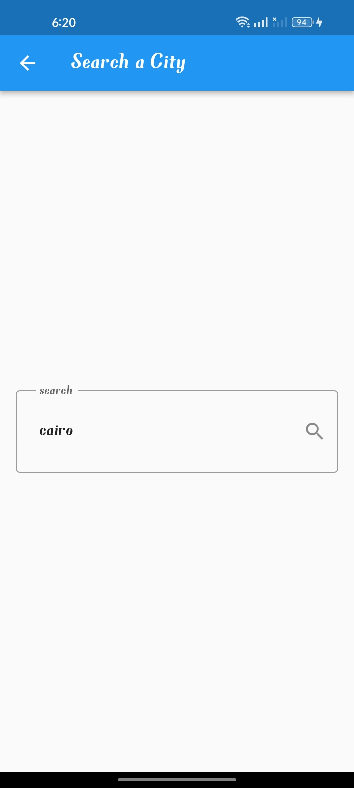

# Weather-App 


## Description

This is a Flutter weather application that utilizes the `http` package to interact with the `http://api.weatherapi.com/v1` API for fetching weather data. The app is built using the Bloc state management library, providing a simple and efficient way to manage application state across widgets.

## Features

- Forecast for the current days
- Ability to search for weather in different cities
- Clean and intuitive user interface

## Screenshots





## Installation

To run this application on your local machine, make sure you have Flutter installed. Then follow these steps:

1. Clone this repository to your local machine using:
   ```
   git clone https://github.com/your-username/weather-app.git
   ```

2. Navigate to the project directory:
   ```
   cd weather-app
   ```

3. Install the required dependencies:
   ```
   flutter pub get
   ```

4. Create a free account on `http://api.weatherapi.com` to obtain an API key.


5. Run the app on an emulator or physical device:
   ```
   flutter run
   ```

## Dependencies

The main dependencies used in this project are:

- [http](https://pub.dev/packages/http) - For making API requests
- [Bloc](https://pub.dev/packages/flutter_bloc) - For state management

For more details about other dependencies, check the `pubspec.yaml` file.

## API Documentation

The app communicates with the Weather API v1 provided by `http://api.weatherapi.com/v1`. You can find the API documentation at [weatherapi.com/docs](http://weatherapi.com/docs) for reference.

